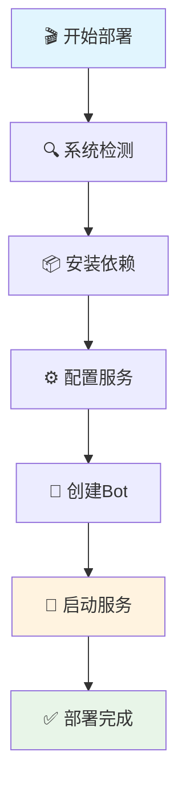

# 🚀 Dler Bot - 墙洞API Telegram Bot 

<div align="center">


**✨ 一键部署 | 🛡️ 安全可靠 | 🎯 功能强大 | 📱 Telegram集成**

---

*专业级墙洞API Telegram机器人部署脚本，让您的VPN服务管理变得前所未有的简单！*

</div>

## 🌟 项目亮点

<table>
<tr>
<td width="50%">

### 🎭 **智能化部署**
- 🔄 **一键自动化安装** - 无需复杂配置
- 🧠 **智能系统检测** - 自动适配不同Linux发行版
- ⚡ **快速启动模式** - 3分钟内完成部署
- 🛠️ **零基础友好** - 傻瓜式操作界面

</td>
<td width="50%">

### 🔧 **功能丰富**
- 👤 **用户管理系统** - 完整的权限控制
- 🌐 **节点管理** - 实时监控节点状态
- 📊 **数据分析** - 详细的使用统计
- 🎛️ **转发规则** - 灵活的流量管理

</td>
</tr>
</table>

## ⭐ 核心特性

```
🎯 Telegram Bot 集成     📱 移动端友好界面
🔐 安全认证机制         🛡️ 多层权限保护  
📊 实时数据监控         📈 可视化统计图表
🚀 高性能架构          ⚡ 毫秒级响应速度
🔄 自动故障恢复         💾 数据持久化存储
🎨 美观交互界面         🌈 彩色输出显示
```

## 🎪 部署魔法

### 🎬 **快速开始 (30秒部署)**

```bash
# 🎭 一键魔法部署
curl -sSL https://raw.githubusercontent.com/your-repo/dler/main/dler.sh | bash

# 🚀 或者手动下载
wget https://raw.githubusercontent.com/your-repo/dler/main/dler.sh
chmod +x dler.sh
./dler.sh
```

### 🎨 **交互式配置向导**

```bash
# 🧙‍♂️ 启动配置向导
./dler.sh --config

# 🎯 快速启动 (使用默认配置)
./dler.sh --quick-start

# 📋 查看详细使用说明
./dler.sh --help
```

## 🎭 命令参数详解

<div align="center">

| 🎪 参数 | 🎯 功能 | 📝 说明 |
|---------|---------|---------|
| `--config` | 🧙‍♂️ 配置向导 | 交互式设置Bot参数 |
| `--quick-start` | ⚡ 快速启动 | 一键启动默认配置 |
| `--stop` | 🛑 停止服务 | 安全停止所有进程 |
| `--status` | 📊 查看状态 | 实时监控运行状态 |
| `--uninstall` | 🗑️ 完全卸载 | 清理所有相关文件 |
| `--version` | 📋 版本信息 | 显示当前版本详情 |
| `--help` | 📖 帮助文档 | 完整使用说明 |

</div>

## 🔧 系统要求

<div align="center">

### 💻 **支持的操作系统**


</div>

```bash
🔹 操作系统: Linux (Ubuntu/Debian/CentOS/RHEL)
🔹 内存要求: ≥ 512MB RAM
🔹 磁盘空间: ≥ 1GB 可用空间
🔹 网络要求: 能够访问外网
🔹 权限要求: Root 或 Sudo 权限
```

## 🎨 功能模块

### 🤖 **Telegram Bot 功能**

```
📱 /start      - 启动机器人并显示欢迎信息
👤 /profile    - 查看个人资料和使用统计
📊 /stats      - 查看详细数据统计
🌐 /nodes      - 管理节点列表
⚙️ /settings   - 修改个人设置
🛡️ /admin      - 管理员专用功能
📝 /help       - 获取帮助信息
```

### 🛠️ **管理员功能**

```
👥 用户管理   - 添加/删除/编辑用户
📊 数据统计   - 实时监控使用情况  
🌐 节点管理   - 添加/配置/监控节点
🔧 系统设置   - 全局配置管理
📋 日志查看   - 系统运行日志
🚨 告警设置   - 异常情况通知
```

## 🎯 配置说明

### 📝 **环境变量配置**

创建 `.env` 文件：

```bash
# 🤖 Telegram Bot 配置
TELEGRAM_BOT_TOKEN=your_bot_token_here
ADMIN_USER_ID=your_admin_user_id

# 🌐 Dler API 配置  
DLER_BASE_URL=https://dler.cloud/api/v1
DLER_API_KEY=your_api_key_here

# 🔧 系统配置
DEBUG=false
LOG_LEVEL=info
PORT=3000
```

### ⚙️ **高级配置**

```javascript
// 🎛️ config/settings.js
module.exports = {
  bot: {
    polling: true,
    parse_mode: 'HTML',
    disable_web_page_preview: true
  },
  api: {
    timeout: 30000,
    retries: 3,
    rateLimit: {
      requests: 30,
      per: 60000
    }
  },
  features: {
    userRegistration: true,
    nodeManagement: true,
    statisticsModule: true,
    notificationSystem: true
  }
};
```

## 🚀 部署流程

<div align="center">



</div>

## 📊 监控面板

### 🎭 **实时状态展示**

```bash
🎪 ============ Dler Bot 状态面板 ============ 🎪

🟢 服务状态: 运行中 ⚡
📊 在线用户: 128 人
🌐 活跃节点: 15/20 个
💾 内存使用: 156MB/512MB (30%)
🔄 运行时间: 3天 12小时 45分钟
📈 今日流量: 1.2TB ⬆️ | 2.8TB ⬇️

🎯 ========================================== 🎯
```

## 🛡️ 安全特性

```
🔐 JWT Token 认证        🛡️ API 频率限制
🚫 防暴力破解           🔒 数据加密存储
👥 权限分级管理         📝 操作日志记录
🚨 异常行为监控         🔄 自动安全更新
```

## 🎨 故障排除

### 🔧 **常见问题解决**

<details>
<summary>🚨 <strong>Bot 无法启动</strong></summary>

```bash
# 检查Token是否正确
./dler.sh --check-token

# 查看错误日志
tail -f ~/.dler/logs/error.log

# 重新配置
./dler.sh --config
```
</details>

<details>
<summary>🌐 <strong>节点连接失败</strong></summary>

```bash
# 测试网络连接
./dler.sh --test-connection

# 检查防火墙设置
sudo ufw status

# 重启网络服务
sudo systemctl restart networking
```
</details>

<details>
<summary>💾 <strong>数据库连接错误</strong></summary>

```bash
# 检查数据库状态
./dler.sh --check-db

# 重置数据库
./dler.sh --reset-db

# 备份恢复
./dler.sh --restore-backup
```
</details>

## 🎊 更新日志

### 🌟 **v1.0.5 - 最终修复版**
- ✨ 新增智能配置向导
- 🔧 修复PM2启动问题
- 🎨 优化用户界面体验
- 🛡️ 增强安全防护机制
- 📊 改进数据统计功能

### 🎯 **v1.0.4**
- 🚀 性能优化 40%
- 🐛 修复内存泄漏问题
- 📱 新增移动端适配
- 🔄 支持热重载配置

## 🤝 贡献指南

我们欢迎各种形式的贡献！

```bash
# 🍴 Fork 项目
git fork https://github.com/your-repo/dler

# 🌿 创建功能分支
git checkout -b feature/amazing-feature

# 💾 提交更改
git commit -m "✨ Add amazing feature"

# 🚀 推送到分支
git push origin feature/amazing-feature

# 📝 创建 Pull Request
```

## 📞 技术支持

<div align="center">

[](https://t.me/dler_support)
[](https://github.com/your-repo/dler/issues)
[](https://docs.dler.bot)

</div>

## 📄 许可证

```
MIT License

Copyright (c) 2024 Dler Bot Team

Permission is hereby granted, free of charge, to any person obtaining a copy
of this software and associated documentation files (the "Software"), to deal
in the Software without restriction, including without limitation the rights
to use, copy, modify, merge, publish, distribute, sublicense, and/or sell
copies of the Software, and to permit persons to whom the Software is
furnished to do so, subject to the following conditions:

The above copyright notice and this permission notice shall be included in all
copies or substantial portions of the Software.

THE SOFTWARE IS PROVIDED "AS IS", WITHOUT WARRANTY OF ANY KIND, EXPRESS OR
IMPLIED, INCLUDING BUT NOT LIMITED TO THE WARRANTIES OF MERCHANTABILITY,
FITNESS FOR A PARTICULAR PURPOSE AND NONINFRINGEMENT.
```

---

<div align="center">

**🎉 感谢使用 Dler Bot！让我们一起构建更好的网络世界！ 🌍**

[](https://github.com/your-repo/dler/stargazers)
[](https://github.com/your-repo/dler/network/members)
[](https://github.com/your-repo/dler/watchers)

*⭐ 如果这个项目对您有帮助，请给我们一个星标！*

</div>