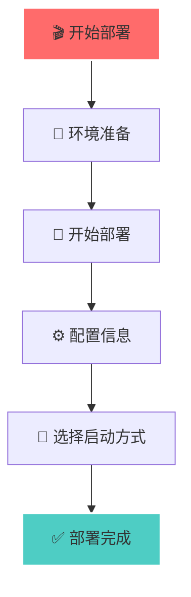

# 🌟 墙洞API Telegram Bot 完整部署指南 🌟

<div align="center">

```
██╗    ██╗ █████╗ ██╗     ██╗         ██████╗  ██████╗ ████████╗
██║    ██║██╔══██╗██║     ██║         ██╔══██╗██╔═══██╗╚══██╔══╝
██║ █╗ ██║███████║██║     ██║         ██████╔╝██║   ██║   ██║   
██║███╗██║██╔══██║██║     ██║         ██╔══██╗██║   ██║   ██║   
╚███╔███╔╝██║  ██║███████╗███████╗    ██████╔╝╚██████╔╝   ██║   
 ╚══╝╚══╝ ╚═╝  ╚═╝╚══════╝╚══════╝    ╚═════╝  ╚═════╝    ╚═╝   
```

[](https://github.com)
[](https://github.com)
[](https://github.com)
[](https://github.com)

</div>

---

## 🎯 项目概述

> 🎉 **欢迎使用墙洞API Telegram Bot完整部署系统！**  
> 这是一个功能完整的Telegram Bot自动化部署脚本项目，专为墙洞API服务设计。  
> 提供从安装、配置到管理的全流程自动化解决方案。

```
    🚀 一键部署    ⚙️ 智能配置    🔧 完整管理    📊 实时监控
         ↓             ↓             ↓             ↓
    自动化流程     配置文件生成     服务管理       状态检查
```

---

## ✨ 主要特性

<table>
<tr>
<td align="center" width="20%">

<br><strong>完全自动化</strong>
<br>无需手动干预的部署流程
</td>
<td align="center" width="20%">

<br><strong>自动化配置</strong>
<br>智能生成配置文件和环境设置
</td>
<td align="center" width="20%">

<br><strong>全生命周期</strong>
<br>安装、配置、管理、测试、卸载
</td>
<td align="center" width="20%">

<br><strong>实时监控</strong>
<br>系统状态检查和性能监控
</td>
<td align="center" width="20%">

<br><strong>安全保障</strong>
<br>权限检查和密码加密存储
</td>
</tr>
</table>

### 🌈 核心功能亮点

| 功能模块 | 描述 | 状态 |
|---------|------|------|
| 🔄 **多种启动方式** | PM2、SystemD、Screen等 |  |
| 📱 **丰富Bot功能** | 登录管理、转发规则、状态查询 |  |
| 🔐 **密码加密** | AES-256-CBC加密存储 |  |
| 🎨 **彩色日志** | 美观的日志输出界面 |  |
| 🔧 **故障恢复** | 自动重启和故障处理 |  |
| 📈 **性能监控** | 实时性能数据监控 |  |

## 📁 文件结构

<div align="center">

```
🗂️ dler/
├── 📜 dler.sh              # 🔧 主要部署脚本
├── 📖 项目介绍.md          # 📝 项目介绍文档
└── 📦 部署后生成的文件：
    ├── 🤖 bot.js           # 🚀 Telegram Bot主程序
    ├── 📋 package.json     # 📦 Node.js依赖配置
    ├── ⚙️ .env             # 🔐 环境变量配置
    ├── ▶️ start.sh         # 🟢 启动脚本
    ├── ⏸️ stop.sh          # 🔴 停止脚本
    ├── 📊 status.sh        # 💻 状态检查脚本
    ├── ⚡ quick-start.sh   # 🚀 快速启动脚本
    └── 🗑️ uninstall.sh     # ❌ 卸载脚本
```

</div>

---

## 🚀 安装部署教程

### 💻 系统要求

<div align="center">

| 项目 | 要求 | 状态 |
|------|------|------|
| 🖥️ **操作系统** | Linux (Ubuntu/CentOS/Debian) |  |
| 👑 **权限** | Root用户权限 |  |
| 🌐 **网络** | 稳定的网络连接 |  |
| 💾 **内存** | 建议至少512MB |  |

</div>

### ⚡ 快速部署

<details>
<summary>🎬 <strong>点击展开快速部署步骤</strong></summary>

```bash
# 🎯 Step 1: 下载并运行部署脚本
bash dler.sh

# 🎯 Step 2: 按照提示完成配置
# 📋 需要配置的项目：
# ├── 🤖 Telegram Bot Token (从 @BotFather 获取)
# ├── 👤 管理员用户ID (你的Telegram用户ID)
# ├── 🔧 墙洞API配置 (根据实际情况)
# └── 🎨 其他个性化设置
```

</details>

### 📋 详细安装步骤

<div align="center">



</div>

#### 🔧 Step 1：环境准备
```bash
# 👑 确保以root权限运行
sudo -i

# 📂 进入工作目录
cd /root/dler

# 🔑 给脚本执行权限
chmod +x dler.sh
```

#### 🚀 Step 2：开始部署
```bash
# 🎯 运行部署脚本
./dler.sh
```

#### ⚙️ Step 3：配置信息
<div align="center">

| 配置项 | 说明 | 获取方式 |
|--------|------|----------|
| 🤖 **Telegram Bot Token** | 机器人认证令牌 |  |
| 👤 **管理员用户ID** | 你的Telegram用户ID |  |
| 🔧 **墙洞API配置** | API相关配置 |  |

</div>

#### 🎯 Step 4：选择启动方式

<div align="center">

| 启动方式 | 描述 | 推荐度 |
|----------|------|--------|
| 1️⃣ **PM2启动** | 进程管理器，推荐生产环境 |  |
| 2️⃣ **SystemD服务** | 系统服务，开机自启 |  |
| 3️⃣ **Screen后台运行** | 后台运行，简单易用 |  |
| 4️⃣ **Node.js直接运行** | 直接运行，不推荐生产 |  |
| 5️⃣ **前台运行** | 调试模式，用于测试 |  |
| 6️⃣ **测试模式** | 功能测试，验证配置 |  |
| 7️⃣ **快速启动** | 一键启动，便捷操作 |  |

</div>

---

## 🎮 使用教程

### 🤖 Bot命令大全

<div align="center">

```
  🎯 基础命令    👤 账户管理    🔄 转发规则    🔧 系统管理
      ↓             ↓             ↓             ↓
   基础操作      登录管理      规则操作      系统监控
```

</div>

#### 🎯 基础命令
<div align="center">

| 命令 | 功能 | 示例 |
|------|------|------|
|  | 启动机器人并查看欢迎信息 | `/start` |
|  | 显示帮助信息和命令列表 | `/help` |
|  | 查看系统状态和运行信息 | `/status` |

</div>

#### 👤 账户管理
<div align="center">

| 命令 | 功能 | 示例 |
|------|------|------|
|  | 登录墙洞账户 | `/login` |
|  | 登出并删除Token | `/logout` |
|  | 管理保存的登录凭据 | `/creds` |
|  | 查看当前登录用户信息 | `/me` |

</div>

#### 🔄 转发规则管理
<div align="center">

| 命令 | 功能 | 示例 |
|------|------|------|
|  | 查看所有转发规则 | `/getrules` |
|  | 添加新的转发规则 | `/addrule` |
|  | 删除指定的转发规则 | `/delrule 123` |

</div>

#### 🔧 系统管理
<div align="center">

| 命令 | 功能 | 示例 |
|------|------|------|
|  | 测试机器人响应 | `/ping` |
|  | 查看机器人详细信息 | `/info` |
|  | 开启调试模式 | `/debug` |

</div>

### 🔧 服务管理命令

<div align="center">

```
🔧 服务管理
├── ▶️ 启动服务
├── ⏸️ 停止服务  
├── 📊 查看状态
└── 🔄 重启服务
```

</div>

#### ▶️ 启动服务

<details>
<summary>🚀 <strong>点击查看启动命令</strong></summary>

```bash
# 🎯 使用生成的启动脚本
./start.sh

# 🔧 或者选择特定方式启动
./start.sh pm2        # 🟢 PM2方式启动
./start.sh systemd    # 🔵 SystemD服务启动  
./start.sh screen     # 🟡 Screen后台启动
```

</details>

#### ⏸️ 停止服务

<details>
<summary>🛑 <strong>点击查看停止命令</strong></summary>

```bash
# 🎯 停止服务
./stop.sh

# 🔧 或者使用PM2命令
pm2 stop dler-bot     # ⏸️ 停止服务
pm2 delete dler-bot   # 🗑️ 删除服务
```

</details>

#### 📊 查看状态

<details>
<summary>📈 <strong>点击查看状态命令</strong></summary>

```bash
# 🎯 查看服务状态
./status.sh

# 🔧 查看PM2状态
pm2 status dler-bot   # 📊 查看状态
pm2 logs dler-bot     # 📋 查看日志

# 🔧 查看SystemD状态  
systemctl status dler-bot  # 💻 系统服务状态
```

</details>

#### 🔄 重启服务

<details>
<summary>🔄 <strong>点击查看重启命令</strong></summary>

```bash
# 🟢 PM2重启
pm2 restart dler-bot

# 🔵 SystemD重启
systemctl restart dler-bot
```

</details>

---

## 🔧 配置文件说明

### ⚙️ 环境变量配置 (.env)

<div align="center">

| 变量名 | 描述 | 示例值 |
|--------|------|--------|
|  | 机器人Token | `123456789:ABCdefGHIjklMNOpqrsTUVwxyz` |
|  | 管理员用户ID | `123456789` |
|  | 运行环境 | `production` |
|  | 监听端口 | `3000` |

</div>

```env
# 🤖 机器人配置
TELEGRAM_BOT_TOKEN=你的Bot Token
ADMIN_USER_ID=你的用户ID

# 🌍 运行环境
NODE_ENV=production
PORT=3000
```

### 🎛️ 系统配置

<div align="center">

| 配置项 | 说明 | 默认值 |
|--------|------|--------|
|  | 可通过环境变量调整 | `INFO` |
|  | PM2自动处理崩溃重启 | `开启` |
|  | 默认监听端口 | `3000` |

</div>

---

## 🧪 测试功能

### 🔍 健康检查

<details>
<summary>💊 <strong>点击查看健康检查命令</strong></summary>

```bash
# 🧪 运行内置测试
node test.js

# 🤖 或通过Bot命令测试
# 在Telegram中发送：/status
```

</details>

### 🎯 功能测试

<div align="center">

| 测试类型 | 测试命令 | 预期结果 |
|----------|----------|----------|
|  | `/login` |  |
|  | `/status` |  |
|  | `/addrule` |  |

</div>

---

## 🗑️ 卸载教程

### 🤖 自动卸载

<details>
<summary>🗑️ <strong>点击查看自动卸载步骤</strong></summary>

```bash
# 🎯 使用生成的卸载脚本
./uninstall.sh

# 📋 按提示选择卸载选项：
# ├── 1️⃣ 停止并删除服务
# ├── 2️⃣ 删除PM2进程和配置
# ├── 3️⃣ 删除systemd服务
# ├── 4️⃣ 删除项目目录和所有文件
# └── 5️⃣ 可选：卸载Node.js和PM2
```

</details>

### 🔧 手动卸载

<details>
<summary>⚙️ <strong>点击查看手动卸载步骤</strong></summary>

```bash
# 1️⃣ 停止服务
pm2 stop dler-bot     # ⏸️ 停止服务
pm2 delete dler-bot   # 🗑️ 删除服务

# 2️⃣ 删除SystemD服务
sudo systemctl stop dler-bot                           # 🛑 停止服务
sudo systemctl disable dler-bot                        # ❌ 禁用服务
sudo rm -f /etc/systemd/system/dler-bot.service       # 🗑️ 删除服务文件

# 3️⃣ 删除项目文件
rm -rf /root/dler     # 🗂️ 删除项目目录

# 4️⃣ 可选：卸载依赖
npm uninstall -g pm2                        # 🗑️ 卸载PM2
# ⚠️ 谨慎：sudo apt-get remove nodejs npm  # 🗑️ 卸载Node.js
```

</details>

---

## 📊 监控和日志

### 📋 查看日志

<details>
<summary>📖 <strong>点击查看日志命令</strong></summary>

```bash
# 🟢 PM2日志
pm2 logs dler-bot                    # 📋 查看实时日志

# 🔵 SystemD日志
journalctl -u dler-bot -f            # 📋 查看系统日志

# 📁 直接查看日志文件
tail -f ~/.pm2/logs/dler-bot-out.log     # 📤 输出日志
tail -f ~/.pm2/logs/dler-bot-error.log   # ❌ 错误日志
```

</details>

### 📈 性能监控

<details>
<summary>📊 <strong>点击查看监控命令</strong></summary>

```bash
# 🟢 PM2监控
pm2 monit                        # 📊 实时监控界面

# 📈 系统资源监控
pm2 status                       # 📊 服务状态
```

</details>

---

## 🔒 安全说明

### 🔐 密码安全

<div align="center">

| 安全特性 | 描述 | 状态 |
|----------|------|------|
|  | 使用AES-256-CBC加密存储 |  |
|  | Token自动刷新机制 |  |
|  | 可随时删除保存的凭据 |  |

</div>

### 👑 权限控制

<div align="center">

| 权限机制 | 描述 | 状态 |
|----------|------|------|
|  | 仅管理员可使用管理命令 |  |
|  | 用户ID白名单机制 |  |
|  | 安全的API调用验证 |  |

</div>

---

## 🆘 故障排除

### 🐛 常见问题

#### 🤖 Bot无法启动

<details>
<summary>🔧 <strong>点击查看解决方案</strong></summary>

```bash
# 1️⃣ 检查Token是否正确
# 2️⃣ 检查网络连接
# 3️⃣ 查看错误日志
pm2 logs dler-bot --lines 50    # 📋 查看最近50行日志
```

</details>

#### 🔑 登录失败

<details>
<summary>🔧 <strong>点击查看解决方案</strong></summary>

```bash
# 1️⃣ 检查墙洞API连接
# 2️⃣ 验证账户密码
# 3️⃣ 清除保存的凭据
```

</details>

#### 🔄 转发规则无效

<details>
<summary>🔧 <strong>点击查看解决方案</strong></summary>

```bash
# 1️⃣ 检查规则格式
# 2️⃣ 验证API权限
# 3️⃣ 查看详细错误信息
```

</details>

### 🆘 获取支持

<div align="center">

| 支持方式 | 描述 |
|----------|------|
|  | 查看日志文件定位问题 |
|  | 使用 `/debug` 命令开启调试模式 |
|  | 联系开发团队获取技术支持 |

</div>

---

## 📈 版本信息

<div align="center">

```
🎯 项目版本信息
├── 📦 当前版本: v1.0.5 - 最终修复版
├── 👥 开发团队: Dler Bot Team  
├── 📅 更新日期: 2024年
└── 🖥️ 兼容性: Linux Ubuntu/CentOS/Debian
```

</div>

---

## 🎯 核心功能特性

<div align="center">

| 功能模块 | 状态 | 描述 |
|----------|------|------|
|  | ✅ | 完整的账户管理系统 |
|  | ✅ | 转发规则管理 (添加/查看/删除) |
|  | ✅ | 实时状态监控 |
|  | ✅ | 密码加密存储 |
|  | ✅ | 多种启动方式支持 |
|  | ✅ | 自动重启和故障恢复 |
|  | ✅ | 完善的日志记录系统 |
|  | ✅ | 一键部署和卸载 |

</div>

---

<div align="center">

```
🎉 感谢使用墙洞API Telegram Bot部署系统！
如有问题请查看文档或联系技术支持

🌟 Star this project if you like it! 🌟
```

[](https://github.com)
[](https://nodejs.org/)
[](https://pm2.keymetrics.io/)

</div>
